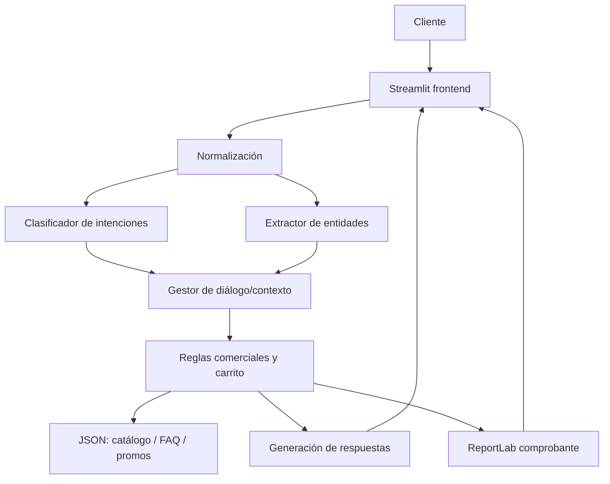

# Arquitectura

```mermaid
flowchart TD
 U[Cliente] --> UI[Streamlit frontend]
 UI --> NLP[Normalización]
 NLP --> CL[Clasificador de intenciones]
 NLP --> EN[Extractor de entidades]
 CL --> DG[Gestor de diálogo/contexto]
 EN --> DG
 DG --> BR[Reglas comerciales y carrito]
 BR --> KB[JSON: catálogo / FAQ / promos]
 BR --> RG[Generación de respuestas]
 BR --> PDF[ReportLab comprobante]
 RG --> UI
 PDF --> UI
```

El cliente browser se conecta al servidor Python Streamlit. El estado conversacional es por sesión. Las reglas no llaman a servicios externos.
